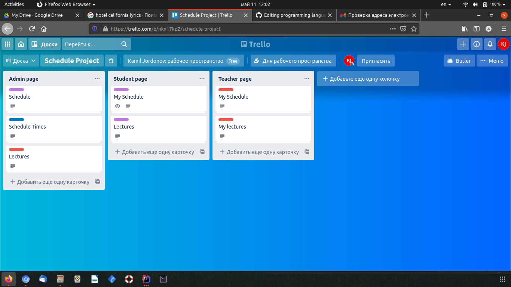

# My Schedule

Online Scheduling platform

##Application link
https://kamilschedule.herokuapp.com

## Used Technologies

* Java
* Spring Boot
* Maven
* HTML, CSS, JavaScript
* Thymeleaf
* Postgresql
* Heroku
* Github
* Figma
* Trello

## User Guide

download below video to view the tutorial with user guide

###FIgma link

https://www.figma.com/file/icb6a26PfBFqBfnsH0EbLe/Schedule?node-id=0%3A1

###Trello link and screenshot

https://trello.com/b/nkx17kpZ

